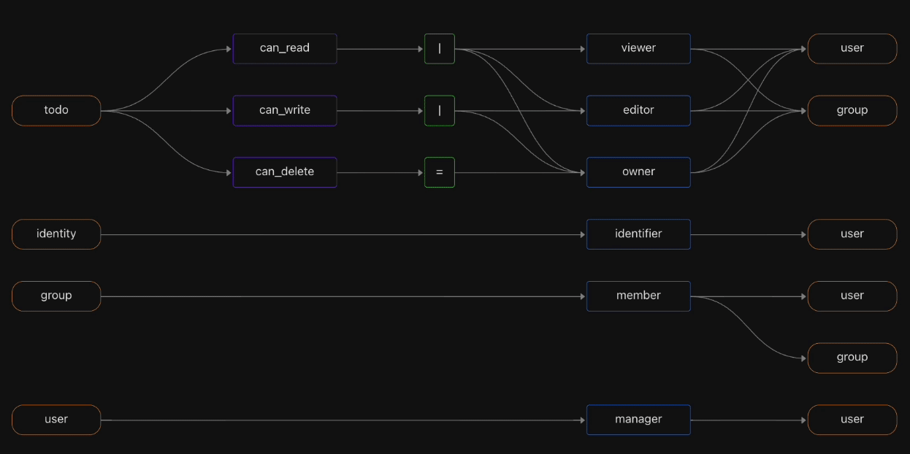

# Eamerald - cloud-native authorization for modern applications and APIs

[](https://github.com/threehook/eamerald/actions/workflows/ci.yaml)


Eamerald is an open-source authorization service providing fine-grained, real-time, policy-based access control for applications and APIs.  
It uses the [Open Policy Agent](https://www.openpolicyagent.org/) (OPA) as its decision engine, and provides a built-in directory that is inspired by the Google [Zanzibar](https://research.google/pubs/pub48190/) data model.  
Authorization policies can leverage user attributes, group membership, application resources, and relationships between them. All data used for authorization is modeled and stored locally in an embedded database, so authorization decisions can be evaluated quickly and efficiently.  
Eamerald supports multiple authorization models - Relationship-Based (ReBAC), Role-Based (RBAC), and Attribute-Based (ABAC) - and lets you combine them in a single decision.  

## Documentation and support

See the [docs](docs/config.md) directory for configuration reference (`docs/config.md`) and feature-flag documentation (`docs/fflag/`).

## Benefits

### Authorization in one place

A single authorization service, instead of spreading authorization logic everywhere.

### Fine-grained

Following the Principle of Least Privilege, assign the smallest set of fine-grained permissions to each user or group.

### Policy-based

Convert authorization "spaghetti code" into a policy expressed in its own domain-specific language, managed as code, and built into an immutable, signed artifact.

Policies are written in Rego v1, the syntax of OPA 1.0: rule heads use `if` and `contains`, and `import rego.v1` is not needed.

### Real-time

Gate each protected resource with an authorization call that ensures the user has the right permission.

### Blazing fast

Deploy the authorizer as a sidecar or microservice, right next to your app, for low latency and high availability.

### Comprehensive decision logging

Log every decision to facilitate audit trails, compliance, and forensics.

### Flexible authorization model

Start simple, and grow from multi-tenant RBAC to ABAC or ReBAC, or a combination - see [authorization models](docs/authorization-models.md).

### Capture your domain model

Create object types and relationships that reflect your domain model.

<details>
  <summary style="font-size: 1.0rem; color: #0066cc; text-decoration: underline; cursor: pointer;">
    Eamerald model visualization
  </summary>
  
</details>

### Separation of concerns

Application developers can own the app logic, and security engineers can own the authorization policy.

## Table of Contents
- [Getting Eamerald](#getting-eamerald)
    - [Building from source](#building-from-source)
    - [Deploying](#deploying)
- [Quickstart](#quickstart)
    - [Deploy Eamerald](#deploy-eamerald)
    - [Issue an authorization request](#issue-an-authorization-request)
- [Command line client](#command-line-client)
- [gRPC Endpoints](#grpc-endpoints)
- [Credits](#credits)
- [Contribution Guidelines](#contribution-guidelines)

## Getting Eamerald

### Building from source

`eamerald` requires Go 1.27.x to build (see `Makefile`'s `GO_VER`); `go.mod` is pinned to 1.26.3. In order to build `eamerald` from source you must:

 1. Clone the repo
 2. Build the executables

```console
$ make build
```

`make build` compiles for your host platform by default. To target a different platform, set `GOOS`/`GOARCH`, e.g. `GOOS=linux GOARCH=amd64 make build`. The exact output path is listed in the `building binary=...` build log line, or in `dist/artifacts.json`.

`mrld` is the compiled binary name of the Eamerald CLI (built from `mrld/` in this repo). It is a client for a deployed Eamerald; see [Command line client](#command-line-client). To install just the client:

```console
$ go install github.com/threehook/eamerald/mrld@latest
```

### Deploying

Eamerald runs in Kubernetes, through the Helm charts in `k8s/`:

* `k8s/eamerald-hub` - the directory (system of record).
* `k8s/eamerald-edge` - the authorizer, synced from a hub. This is the default topology.
* `k8s/eamerald-standalone` - hub and authorizer in one pod, for a quick local check.

See [`docs/deployments/k8s-hub-edge.md`](docs/deployments/k8s-hub-edge.md) for the hub/edge topology, and `docs/deployments/docker-compose` for a docker compose setup.

## Quickstart

These instructions get Eamerald running as an authorizer, using the Laadpalen example as the domain model and data.

### Deploy Eamerald

Every deployment needs a directory model (`MANIFEST`), and can import data (`DATA`) once deployed:

```console
$ make k8s-deploy MANIFEST=examples/laadpalen/manifest.yaml \
  DATA="examples/laadpalen/laadpalen_objects.jsonl examples/laadpalen/laadpalen_relations.jsonl"
```

This deploys a hub seeded with the manifest and data, then an edge authorizer synced from it. The command returns once the edge has completed its first sync. Applying a manifest wipes the deployment's existing directory data first, since old data may not be valid under a different model.

For a single-pod deployment instead, use `make k8s-deploy-standalone` with the same `MANIFEST` and `DATA`.

On Docker Desktop's Kubernetes the services are available on `localhost`. On other clusters, use `kubectl port-forward`.

For a deeper overview of the Eamerald configuration, see [Eamerald configuration](docs/config.md).

### Issue an authorization request

Issue an authorization request using the AuthZEN Access Evaluation API against the deployed authorizer:

```console
$ curl -k -X POST 'https://localhost:8383/access/v1/evaluation' \
-H 'Content-Type: application/json' \
-d '{
     "subject": {"type": "user", "id": "jerry@example.com"},
     "action": {"name": "request_laadpaal"},
     "resource": {"type": "adres", "properties": {"postcode": "1111BB", "huisnummer": 2}},
     "context": {"doelbinding": "laadpalen"}
}'
```

See [`examples/laadpalen`](examples/laadpalen/README.md) for how this request maps to a policy rule, and for a sample application that makes it.

To start an interactive session with the Eamerald endpoints over gRPC, see the [gRPC endpoints](#grpc-endpoints) section.

## Command line client

`mrld` talks to a deployed Eamerald:

```console
$ mrld --help
```

* `directory` (`ds`) - directory service commands, e.g. `mrld directory import`
* `authorizer` (`az`) - authorizer service commands
* `access` (`ac`) - access service commands
* `certs` - certificate management
* `version` - version information

Run `mrld <command> --help` for more information on a command.

## gRPC Endpoints

To interact with the authorizer endpoint, install [grpcui](https://github.com/fullstorydev/grpcui) or [grpcurl](https://github.com/fullstorydev/grpcurl) and point them to `localhost:8282`:

```console
$ grpcui --insecure localhost:8282
```

To interact with the directory endpoint, use `localhost:9292`:

```console
$ grpcui --insecure localhost:9292
```

## Credits

Eamerald uses a lot of great and amazing open source projects and libraries.

A big thank you to all of them!

## Contribution Guidelines

Eamerald is a work in progress - if something is broken or there's a feature that you want, please file an issue and if so inclined submit a PR!

We welcome contributions from the community! Here are some general guidelines:

* File an issue first prior to submitting a PR!
* Ensure all exported items are properly commented
* If applicable, submit a test suite against your PR
