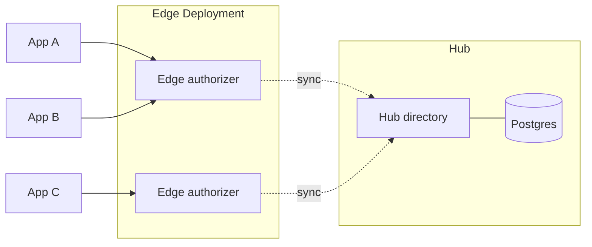
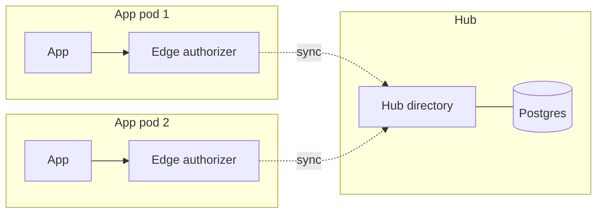

# Kubernetes hub + edge deployment

This document describes the current Eamerald Helm chart roles and the two edge packaging options we support.

## Chart roles (`k8s/eamerald`)

One Helm chart; `role` selects what the install runs:

| Role | Runs | Store | Replicas |
|------|------|--------|----------|
| **standalone** | Directory + authorizer + console | Bolt PVC (default) or Postgres | Usually 1 (Bolt); Postgres can scale |
| **hub** | Directory only (source of truth) | Bolt or Postgres | `replicaCount > 1` only with Postgres |
| **edge** | Authorizer + local directory cache | Per-pod disposable store | Many OK; sync from hub |

**Hub** owns the directory data (Postgres) and exports it on directory gRPC (port `9292`). Edge installs set `edge.hub.address` to that Service.

**Edge** runs an **authorizer** with a local directory cache. It does not seed a manifest and does not keep a durable DB PVC for that cache. The `aserto_edge` plugin pulls from the hub on an interval. Rolling updates are allowed (no shared Bolt file lock).

**Also in the chart:** an init container seeds the manifest for standalone/hub; PVCs apply only to Bolt-backed standalone/hub.

Sidecar packaging for edge lives under [`sidecar-deployment/`](sidecar-deployment/) (copy the edge container into an app Deployment).

## Source of truth and sync

- **Source of truth:** the hub directory (and its store — Bolt or Postgres).
- **Who exports:** the hub (directory Export API).
- **Who pulls:** each edge authorizer (`aserto_edge`), into its **own** local store.
- **Apps** call an authorizer (shared edge Service or localhost sidecar). They do **not** talk to the hub database.

## Architecture A — Shared edge Deployment (ClusterIP)

Apps call a shared edge Service of **authorizers**. Those authorizers sync from the hub (Postgres-backed directory).

**Draw.io:** [shared-edge-deployment.drawio](diagrams/shared-edge-deployment.drawio)

**Chart usage:** install `role: hub`, then one or more `role: edge` releases pointing at the hub address.

## Architecture B — Sidecar edge (in each app pod)

Each app pod embeds an **authorizer** sidecar; the app talks to localhost; each authorizer syncs from the hub (Postgres-backed directory).

**Draw.io:** [sidecar-edge.drawio](diagrams/sidecar-edge.drawio)

**Packaging:** use the example under [`sidecar-deployment/eamerald-edge-sidecar.yaml`](sidecar-deployment/eamerald-edge-sidecar.yaml).

## Both are supported

| | Shared edge Deployment | Sidecar |
|--|------------------------|---------|
| **Check() path** | Cluster network to edge Service | Localhost in the app pod |
| **Ops** | Few edge replicas to run | One edge per app pod |
| **Best for** | Default platform / most apps | Hot paths that need in-process locality |

Default recommendation for most customers: **shared edge Deployment**. Offer **sidecar** when an app needs localhost checks.
