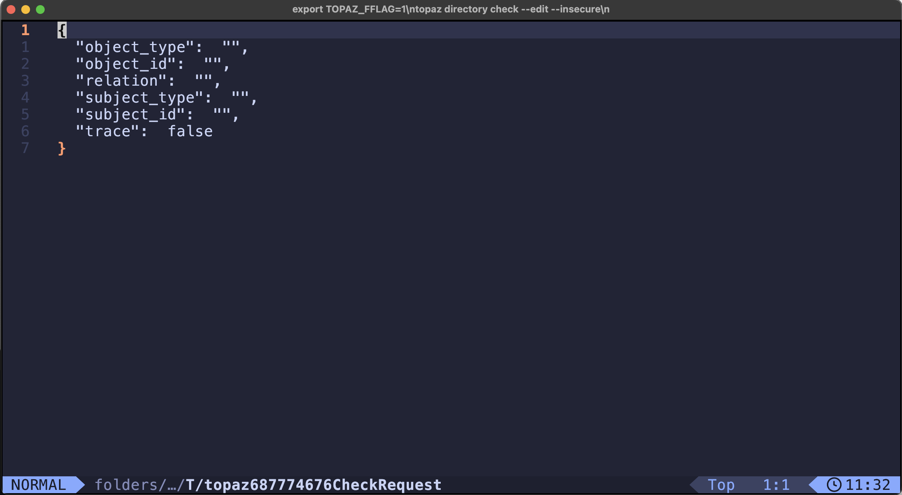
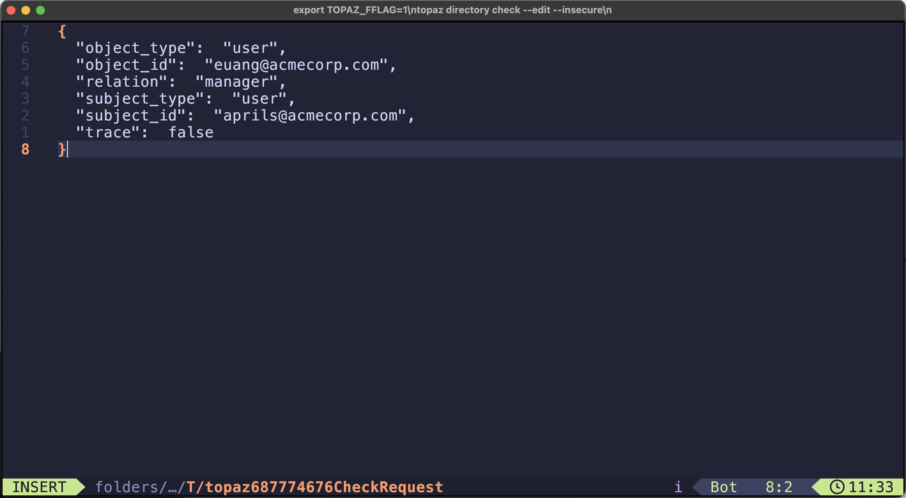

# Eamerald Edit Mode

For those eamerald CLI commands, that accept inline JSON request payloads, like:

```console
$ eamerald directory get object '{"object_type":"user", "object_id":"euang@acmecorp.com"}' --insecure
```

we have added the ability to construct these requests using a text editor.

**NOTE: these enhancements changes require eamerald version `0.32.6` or higher, please check your `eamerald version`**

**NOTE: to enable the new capabilities, one must set the feature flag `EAMERALD_FFLAG` environment variable to the required value.**

See [eamerald feature flags](./eamerald-fflag.md)

## Edit Mode

When using editor mode, the request template output, for example `eamerald directory get --template` will be send to a temporary buffer and presented inside the configured editor. When saved and closed, the request will be parsed and send to the service, similar to the inline request.

When `EAMERALD_FFLAG=1` is set, the following command have the editor mode enabled:

For example:

```
export EAMERALD_FFLAG=1
eamerald directory check --edit --insecure

```
Opening edit:



Finished edit:



Result:

```
{
  "check":  true,
  "trace":  []
}
```

### Edit Mode Commands

#### Directory

* `eamerald directory get object [--edit | e]`
* `eamerald directory set object [--edit | e]`
* `eamerald directory delete object [--edit | e]`
* `eamerald directory list objects [--edit | e]`
* `eamerald directory get relation [--edit | e]`
* `eamerald directory set relation [--edit | e]`
* `eamerald directory delete relation [--edit | e]`
* `eamerald directory list relations [--edit | e]`
* `eamerald directory check [--edit | e]`
* `eamerald directory search [--edit | e]`

#### Authorizer

* `eamerald authorizer eval [--edit | e]`
* `eamerald authorizer query [--edit | e]`
* `eamerald authorizer decisiontree [--edit | e]`
* `eamerald authorizer get-policy [--edit | e]`
* `eamerald authorizer list-policies [--edit | e]`

#### Config

* `eamerald config edit [ config name | `defaults` ]`(defaults to active config)

The `eamerald config edit` command has been added, to allow viewing and updating configuration files.

`eamerald config edit` will open the currently active configuration

`eamerald config <config-name>` like `eamerald config gdrive` will open the gdrive configuration file

`eamerald config defaults` will open the Eamerald CLI configuration file (topaz.json) which contains the default settings section.


### Setting the editor

The editor by default uses to the value of the `EDITOR` environment variable or the `EAMERALD_EDITOR` environment variable.

Example settings:

* `export EAMERALD_EDITOR=nvim`
* `export EAMERALD_EDITOR='code --watch'`
* `export EAMERALD_EDITOR=micro`

